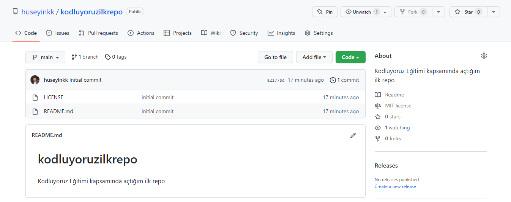

# Kodluyoruz İlk Repo
Bu repo [Kodluyoruz](https://kodluyoruz.org/) eğitimi kapsamında oluşturduğumuz ilk repo
---


# Installation
Öncelikle projeyi clonelayın.(https://github.com/huseyinkk/kodluyoruzilkrepo.git)

git clone https://github.com/huseyinkk/kodluyoruzilkrepo.git

# Usage
Projeyi cloneladıktan sonra Visual Studio Code programında açınız.

### Linux için:

```
cd kodluyoruzilkrepo
code .
```
# Contributing

Pull requestler kabul edilir. Büyük değişiklikler için, lütfen önce neyi değiştirmek istediğinizi tartışmak için bir konu açınız.

# License
[MIT](https://choosealicense.com/licenses/mit/)
